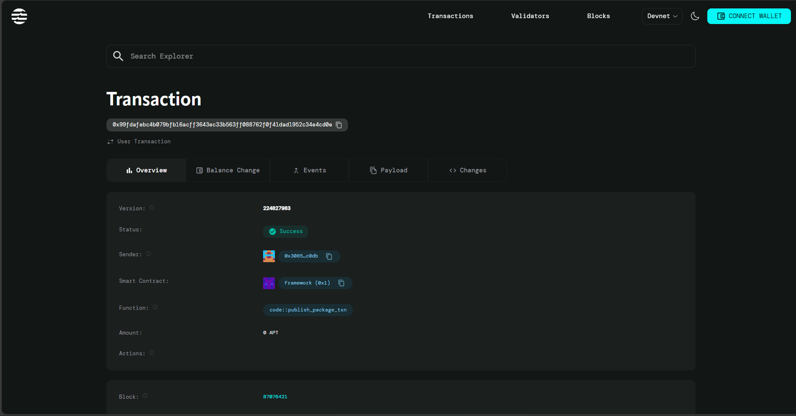

# Student NFT Avatar Generator

## Project Description

The Student NFT Avatar Generator is a blockchain-based smart contract built on the Aptos network that creates personalized NFT avatars for students and rewards them upon completion of educational tasks or milestones. This innovative system combines gamification with blockchain technology to incentivize learning and provide students with unique digital collectibles that represent their academic achievements.

The smart contract manages the creation of student avatar NFTs, tracks completion status of assigned tasks, and automatically distributes cryptocurrency rewards when students successfully complete their educational objectives. Each student receives a unique NFT avatar that serves as both a digital identity and a proof of their academic progress.

## Project Vision

Our vision is to revolutionize education by creating an engaging, reward-based learning ecosystem where students are motivated through blockchain technology and digital ownership. We aim to:

- Transform traditional education through gamification and digital rewards
- Provide students with verifiable digital credentials and collectibles
- Create a decentralized platform that recognizes and rewards academic achievements
- Build a community where learning is incentivized through cryptocurrency and NFT ownership
- Bridge the gap between education and emerging blockchain technologies

## Key Features

- **NFT Avatar Creation**: Generate unique digital avatars for each student as NFTs
- **Completion Tracking**: Monitor and verify student progress on educational tasks
- **Automated Rewards**: Distribute AptosCoin rewards upon successful task completion
- **Blockchain Verification**: All achievements and rewards are permanently recorded on the Aptos blockchain
- **Digital Ownership**: Students truly own their avatar NFTs and can transfer or trade them
- **Transparent System**: All transactions and completions are publicly verifiable
- **Anti-Fraud Protection**: Built-in checks prevent duplicate rewards and unauthorized completions

## Future Scope

### Short-term Goals (3-6 months)
- Integration with educational platforms and learning management systems
- Development of a user-friendly web interface for students and administrators
- Implementation of multiple avatar designs and customization options
- Addition of tiered reward systems based on difficulty levels

### Medium-term Goals (6-12 months)
- Marketplace for trading student NFT avatars
- Integration with multiple educational institutions
- Advanced analytics dashboard for tracking student progress
- Mobile application for iOS and Android platforms

### Long-term Goals (1-2 years)
- Cross-chain compatibility with other blockchain networks
- AI-powered personalized learning recommendations
- Corporate partnerships with educational technology companies
- Expansion to professional certification and skill development programs
- Integration with virtual reality and metaverse platforms for immersive learning experiences

### Advanced Features
- Multi-token support for different types of rewards
- Staking mechanisms for long-term student engagement
- DAO governance for community-driven platform decisions
- Integration with real-world credential verification systems

## Contract Details
0x99fdafebc4b079bfb16acff3643ec33b563ff088762f0f41dad1952c34e4cd0e
